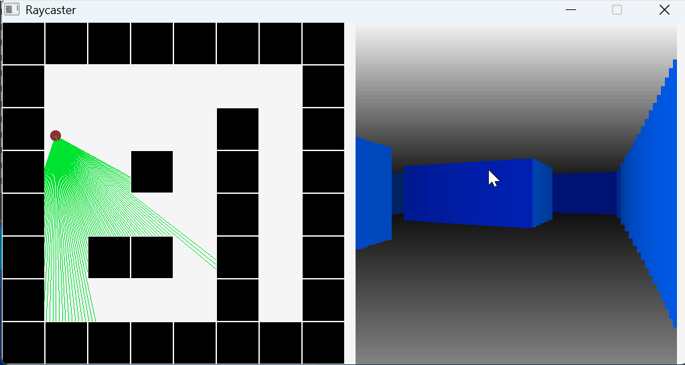

# Raycaster
This project is a pseudo-3D graphics demonstration using a technique called raycasting. Essentially, a player exists in a 2D top-down environment (left side of screen) that has walls and open space. The player emits "rays", which can be thought of as beams of light that gather information about the environment. The rays travel until they hit a wall or reach a defined depth limit. For each ray, a vertical strip is drawn that has a fixed width and a height that is based on the distance the ray traveled. If the ray traveled a long way the strip will be drawn shorter and vice versa. These strips are colored different shades of blue based on the orientation and distance of the wall. They are also drawn over a gradient of white and black which gives the illusion of a floor and ceiling.

